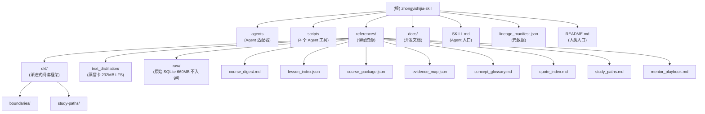

# zhongyishijia-skill — 项目 AI 上下文

> **lineage-skill 格式**的中医世家离线知识库，给 Agent 用。
> 678 本古医书 + 7 万味中药 + 16.6 万条临床理论 + 8 万条综合数据，蒸馏为 **31.7 万张证据卡**。
> 跨东汉-现代 1800 多年，朝代可追溯。

---

## 项目愿景

把中医世家网站（zysj.com.cn）2012-2014 年的完整离线数据**蒸馏**为结构化、可检索、可追溯的 lineage-skill 包，让任何 Agent（Hermes / OpenClaw / Codex / Claude / MiniMax-M3）：

1. **不编造** — 所有回答都可追溯到具体古籍 / 方剂 / 条文；
2. **能溯源** — 每张 evidence card 引用具体《伤寒论》《本草纲目》等古籍；
3. **能跨朝代对比** — 同一方剂的历代医家论述（东汉-现代）按朝代排序；
4. **能按药查方** — 给定一味中药，反查包含此药的所有方剂及成书年代（v3.0 计划）。

> ⚠️ **本知识库为学习参考资料，不替代专业医生诊疗**。

---

## 架构总览



### 数据流

```
中医世家网站原始数据 (CHM 678 本 + MySQL + MSSQL 5.7GB)
        ↓ [lineage-skill build_course_skill.py 蒸馏]
references/text_distillation/evidence_cards.jsonl (232MB, 31.7 万张, git-lfs)
        ↓ [Agent 检索]
scripts/search_course_notes.py / query_formula.py / query_herb.py (v3.0)
        ↓
LLM 检索回答（不编造，可溯源）
```

---

## 模块索引

| 模块 | 路径 | 职责 | 状态 |
|------|------|------|------|
| **agents** | `agents/` | OpenAI/Codex + OpenClaw 接口适配（YAML） | 已生成 |
| **scripts** | `scripts/` | 4 个 Agent 工具：关键词检索 / 朝代方剂查询 / 证据取回 / Markdown 检索 | 已生成，v3.0 扩展中 |
| **references** | `references/` | 课程资源总目录（OKF + 蒸馏卡 + 原始数据 + 索引） | 已生成 |
| **references/okf** | `references/okf/` | OKF 渐进式阅读框架（边界 + 学习路径） | 已生成 |
| **references/text_distillation** | `references/text_distillation/` | 蒸馏后的 31.7 万张证据卡（git-lfs, 232MB） | 已生成 |
| **references/raw** | `references/raw/` | 原始 SQLite 数据库（660MB，**不入 git**） | 已生成 |
| **docs** | `docs/` | v3.0 开发计划与设计文档 | 已生成 |

---

## 运行与开发

### 安装（Hermes Skill 方式）

```powershell
git clone https://github.com/erikgqp8645/zhongyishijia-skill.git
cd zhongyishijia-skill
git lfs install
git lfs pull   # 拉取 232MB evidence_cards.jsonl

# 复制到 Hermes skills 目录
Copy-Item -Recurse . "$env:USERPROFILE\.hermes\skills\zhongyishijia-expert-mentor-lineage"

# 验证
python "$env:USERPROFILE\.hermes\skills\zhongyishijia-expert-mentor-lineage\scripts\search_course_notes.py" '桂枝人参汤'
python "$env:USERPROFILE\.hermes\skills\zhongyishijia-expert-mentor-lineage\scripts\query_formula.py" '桂枝人参汤'
```

### 主要脚本用法

| 脚本 | 用途 | 示例 |
|------|------|------|
| `search_course_notes.py <关键词>` | 关键词全文检索 evidence_cards.jsonl + 所有 markdown | `python scripts/search_course_notes.py 桂枝人参汤` |
| `query_formula.py <方剂名>` | **标准化方剂查询**：按朝代从古至今排序输出 Markdown 表格 | `python scripts/query_formula.py 小柴胡汤` |
| `fetch_course_evidence.py --card-id <id>` | 按 chunk_id/card_id 取证据原文 | `python scripts/fetch_course_evidence.py --card-id bb4302e01c4c1b50` |
| `search_md.py <关键词>` | 全 markdown 文件检索（可选） | `python scripts/search_md.py 伤寒` |
| `query_herb.py <中药名>` **(v3.0 计划)** | 按中药查本药历代本草 + 含此药的所有方剂 | `python scripts/query_herb.py 细辛` |

### 数据重建（可选）

```bash
# 把 660MB SQLite 重新蒸馏为 232MB evidence_cards.jsonl
python scripts/build_evidence_cards.py
# 或（v3.0 重蒸馏）
python scripts/redistill_cards.py
```

---

## 测试策略

### 端到端验证（README 4/4 通过）

| Q# | 问题 | 期望结果 |
|---:|------|---------|
| Q1 | 桂枝人参汤治什么证？ | ≥5 张 card_id，4 部互证古籍，按朝代排序 |
| Q2 | 人参与党参区别？ | 峻补/平补、急救/慢补、归经、价格 |
| Q3 | 麻黄升麻汤是什么方？ | 东汉《伤寒论》/14 味组成/上热下寒病机 |
| Q4 | 理中丸和桂枝人参汤的异同？ | 桂枝人参汤 = 理中汤 + 解表 |

### 数据完整性校验（部署到任何机器必跑）

```bash
# SHA256 校验
python -c "
import hashlib
h = hashlib.sha256()
with open('references/raw/20120413mssql.sqlite', 'rb') as f:
    for chunk in iter(lambda: f.read(8*1024*1024), b''):
        h.update(chunk)
assert h.hexdigest() == '6fa194c9a4177dfdd483c8fd7aa37a9e24e371d0692a85a338777bb6e9aee26f'
print('✓ SHA256 OK')
"

# 行数校验：zysjyj=70350, zysjllsj=166423, zysjzhsj=80809, zysjcell=1229
# .gitignore 验证
git check-ignore references/raw/20120413mssql.sqlite && echo '✓ SQLite 已正确排除'
```

---

## 编码规范

### 1. 路径（跨机器开发）
- **绝对禁止硬编码** `C:\Users\Guo\Desktop\...` 这类个人路径；
- 使用 `find_sqlite_path()` 三级查找顺序：
  1. 环境变量 `ZHONGYISHIJIA_SQLITE`
  2. `~/.cache/zhongyishijia/20120413mssql.sqlite`
  3. `<project>/references/raw/20120413mssql.sqlite`
- 永远用 `pathlib.Path`，不要字符串拼接。

### 2. 编码
- SQLite 是 **GBK**（MSSQL 还原特征）：`conn.text_factory = lambda b: b.decode('gbk', errors='replace')`
- evidence_cards.jsonl 是 **UTF-8**
- Windows 终端输出：`sys.stdout = io.TextIOWrapper(sys.stdout.buffer, encoding='utf-8')`
- HTML 实体：`html.unescape()` 解 `&amp;#236;` 等

### 3. 脚本风格
- 顶部 `from __future__ import annotations` + 类型注解
- argparse + RawDescriptionHelpFormatter + epilog 示例
- Windows / Linux 兼容（用 `pathlib` 而非 `os.path`）
- 所有错误用 `errors='replace'` 容错

### 4. 数据使用纪律
- 严格区分 `references/raw/`（不入 git）和 `references/text_distillation/`（git-lfs 入库）；
- 引用一律用 chunk_id（`zysjyj:444` 形式）做证据锚点；
- 不要把 `source_ref` 当作朝代（17.2% 命中率），用 SOURCE_MAP 推断。

---

## AI 使用指引

### 检索策略（来自 SKILL.md Reference Priority）

1. **首选** `references/okf/index.md`（渐进式阅读入口）
2. **课程级框架** `references/course_digest.md`
3. **课程路径** `references/lesson_index.json`
4. **概念词典** `references/concept_glossary.md`
5. **证据映射** `references/evidence_map.json`
6. **核心证据库** `references/text_distillation/evidence_cards.jsonl`（31.7 万张）
7. **追溯原文** `references/raw/20120413mssql.sqlite`（需本地，660MB）
8. **结构化取回** `scripts/fetch_course_evidence.py --card-id <id>`

### 不要做的事

- ❌ 不要把通用模型知识包装成"课程内容"；
- ❌ 不要在没有 SOURCE_MAP 命中时编造朝代/作者；
- ❌ 不要改动 `references/raw/*.sqlite`（不入 git 但 SHA256 校验）；
- ❌ 不要手动编辑 `evidence_cards.jsonl`（git-lfs，走 LFS 流程）；
- ❌ 不要把原始数据 SQLite 直接进 git（660MB 阻塞仓库）。

### 朝代推断优先级

```
1. SOURCE_MAP 命中（key in source_ref / title / summary）
2. TYPEID_MAP 命中（re.search(r"TypeID=(\d+)", source_ref)）
3. SQLite 字段 ChuChu 直接解析
4. 标记为 "待考"
```

---

## 变更记录 (Changelog)

### 2026-07-06 — 项目 AI 上下文初始化

- **新增** 根级 `CLAUDE.md`（含 Mermaid 模块结构图）
- **新增** 各模块本地 `CLAUDE.md`（agents / scripts / references / okf / text_distillation / raw / docs）
- **新增** `.claude/index.json`（覆盖率与索引元数据）
- **不改动** 任何源代码、原始数据、蒸馏卡

### v3.0（计划中，详见 [docs/PLAN_v3_query_herb.md](./docs/PLAN_v3_query_herb.md)）

- **新增** `scripts/_source_map.py` — 共用朝代/作者映射模块（25+ 新增条目）
- **新增** `scripts/query_herb.py <中药名>` — 按中药查方剂
- **新增** `scripts/build_herb_index.py` + `references/text_distillation/herb_index.jsonl` — 反向索引
- **重构** `scripts/query_formula.py` — 改 import `_source_map`
- **重蒸馏** `evidence_cards.jsonl` — 加 `card_kind/dynasty/book/author/prescribed_herbs` 字段

### v2.0 (2026-07-01)

- **新增** `scripts/query_formula.py` — 标准化方剂/条文查询（朝代排序）
- 内置 53 条 SOURCE_MAP + 29 条 TYPEID_MAP + 11 朝代排序权重

### v1.0 (Initial commit)

- lineage-skill 基础包：SKILL.md + 31.7 万张 evidence_cards.jsonl + 4 个脚本
- 数据来源：中医世家网站 2012-2014 年离线数据